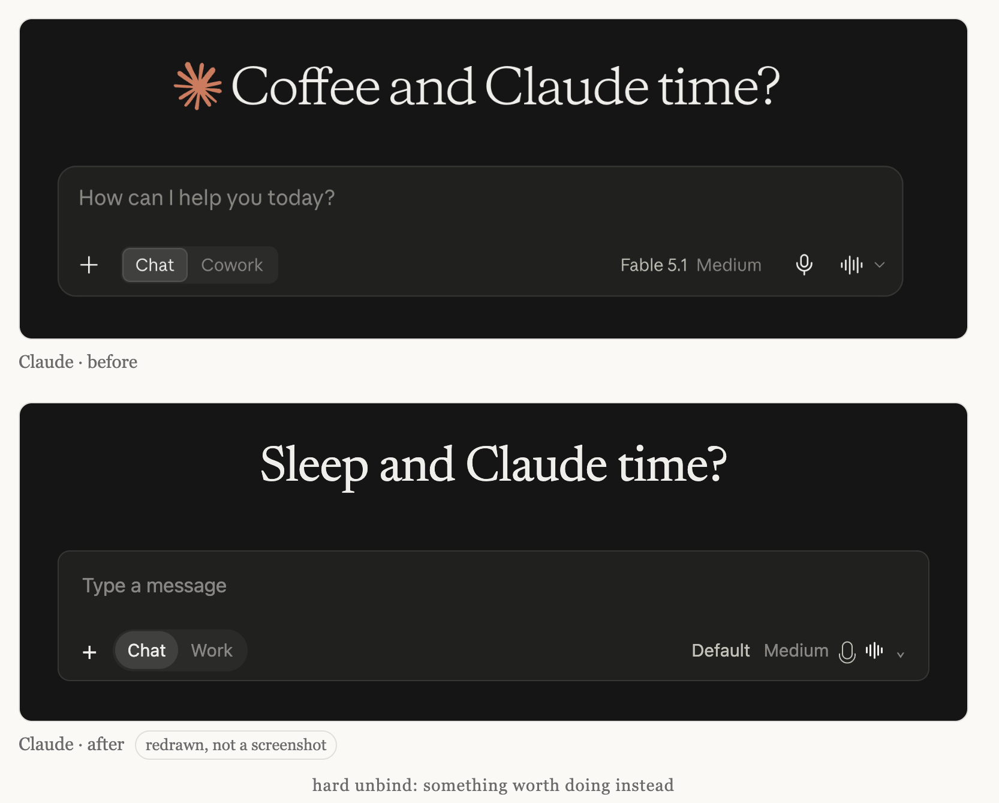

# unbind

Some products open with a greeting that puts coffee next to their own name. This page unties the two.



**unbind** keeps the sentence and swaps the word. Same brand, same beat, something else in the slot:

> **Root canal** and Claude time?
> **报税**和 Claude 时间？

Five kinds of swap: the absurd (root canal), something worth doing instead (sleep), another brand in the same slot (Starbucks), the brand itself (Claude and Claude time?), and the brand dropped into someone else's slogan (A Claude is forever). Every line is written by a person. Claude is the first entry; any brand that greets you with a mood can be next.

Live at <https://unbind.eytoss.com/>.

## Run locally

It is a static page, but it loads `data/pairs.json` with `fetch`, so open it over HTTP rather than as a file:

```bash
python3 -m http.server 8000
```

Then visit <http://localhost:8000>.

## Structure

```
index.html                              main page, random generator, EN / 中文 toggle
words.md                                the word list, edit this one
tools/build_pairs.py                    words.md -> data/pairs.json
data/pairs.json                         generated; the page reads this
screenshots/                            cropped greeting screenshots
.github/ISSUE_TEMPLATE/submission.yml   submission form
```

## Contribute

Open a GitHub issue using the **Submit a pairing** template, or edit `words.md` in a pull request and run the build script. See [CONTRIBUTING.md](CONTRIBUTING.md).

## Disclaimer

Unofficial. Not affiliated with, endorsed by, or sponsored by Anthropic, OpenAI, or any brand named here. In our own text, brand names appear only as plain words. The screenshots are cropped excerpts of each product's own interface, shown for comparison and commentary; the logos and interfaces in them belong to their respective owners.

## License

MIT

---

## 中文

有些产品的欢迎语会把咖啡和自己的名字放在一句话里。这个页面把它们分开。

**unbind** 把句子留着，换掉那个词。同一个品牌，同一个节奏，位置上放点别的。五种换法：荒诞（补牙）、本来该去做的事（睡觉）、别家的名字（星巴克）、它自己（Claude 和 Claude 时间？）、放进别家的口号（Claude 恒久远）。每一句都是人写的。Claude 是第一个词条，任何用情绪跟你打招呼的品牌都可以是下一个。

线上：<https://unbind.eytoss.com/>。本地运行：`python3 -m http.server 8000`，然后打开 <http://localhost:8000>。

投稿：用仓库里的 **投稿** Issue 模板，或直接改 `words.md` 提 PR，然后跑 `python3 tools/build_pairs.py`。

非官方项目，与 Anthropic、OpenAI 及文中提到的任何品牌无关联。我们自己写的内容里品牌名只以纯文字出现；截图是各产品界面的局部节选，用于对比评论，其中的 logo 和界面归各自所有者所有。MIT 许可。
